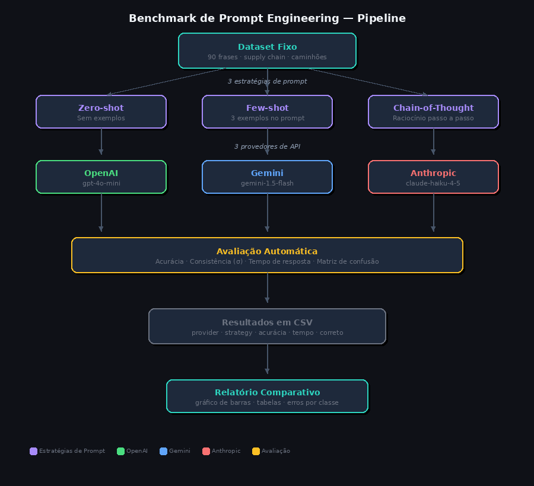

# LLM-Evaluation-Prompts
# Projeto: Benchmark de Técnicas de Prompt Engineering

> **Contexto**: Projeto de pesquisa sobre avaliação de estratégias de prompt engineering em modelos de linguagem (LLMs), com foco em tarefas de classificação de sentimento (NPL) em domínio técnico especializado (supply chain de peças para caminhões). De forma direta vamos usar GPT-4o-mini, Gemini e Claude Haiku com temperatura 0 comparando estratégias de prompt em um domínio especializado.

## O que este projeto faz

Compara **3 estratégias de prompt** × **3 provedores de LLM** numa tarefa fixa de classificação de sentimento (NPL) no domínio de **supply chain de peças para caminhões**.



### Estratégias testadas
| Estratégia | Descrição |
|---|---|
| Zero-shot | Instrução direta, sem exemplos |
| Few-shot | 3 exemplos demonstrativos no prompt |
| Chain-of-Thought | Raciocínio passo a passo antes da resposta |

### Provedores testados
### Provedores testados
| Provedor | Modelo | Justificativa |
|---|---|---|
| OpenAI | gpt-4.1-mini | Modelo leve de última geração, substituto oficial do gpt-4o-mini |
| Gemini | gemini-2.5-flash | Modelo rápido e custo-eficiente da família 2.5 |
| Anthropic | claude-haiku-4-5 | Modelo leve da família Claude 4 |

### Métricas coletadas
- **Acurácia geral e por classe** (positivo / negativo / neutro) mede se o modelo acertou o label correto (tarefa de classificação)
- **Tempo médio de resposta** (ms) mede comportamento operacional da API
- **Consistência** (desvio padrão do tempo — σ menor = mais previsível)
- **Erros por categoria** (matriz de confusão simplificada) - mede onde o modelo erra entre as classes

---

## Estrutura do projeto

```
LLM-Evaluation-Prompts/
├── data/
│   └── dataset.py          # 90 frases anotadas + exemplos few-shot
├── src/
│   ├── prompts.py          # 3 estratégias de prompt engineering
│   └── api_clients.py      # Clientes OpenAI, Gemini e Anthropic
├── results/                # CSVs gerados automaticamente
├── run_benchmark.py        # Script principal (orquestra tudo)
├── analyze_results.py      # Análise e gráficos a partir do CSV
└── requirements.txt
```

---

## Como rodar

### 1. Instalar dependências
```bash
pip install -r requirements.txt
```

### 2. Configurar chaves de API
```bash
export OPENAI_API_KEY="sk-..."
export GEMINI_API_KEY="AIza..."
export ANTHROPIC_API_KEY="sk-ant-..."
```

### 3. Rodar o benchmark
```bash
python run_benchmark.py
```

O script roda **9 combinações** (3 provedores × 3 estratégias) × **90 amostras** = **810 chamadas de API** no total. Com o delay padrão de 0,5s entre chamadas, leva cerca de 10–12 minutos.

### 4. Analisar os resultados
```bash
python analyze_results.py
# Você pode passar o arquivo explicitamente:
python analyze_results.py results/benchmark_20250526_123456.csv
```

---

## Saída esperada

### CSV (`results/benchmark_YYYYMMDD_HHMMSS.csv`)
| Coluna | Descrição |
|---|---|
| provider | openai / gemini / anthropic |
| strategy | zero_shot / few_shot / chain_of_thought |
| sample_id | ID da amostra no dataset |
| text | Frase analisada |
| true_label | Label correto |
| pred_label | Label predito pelo modelo |
| correct | 1 = acerto, 0 = erro |
| elapsed_ms | Tempo da chamada em ms |
| raw_response | Resposta bruta do modelo (truncada) |

### Tabelas de análise
- Acurácia geral e por classe (positivo/negativo/neutro)
- Tempo médio e desvio padrão por (provider, strategy)
- Erros por categoria
- Gráfico de barras (`results/accuracy_chart.png`)

---

## Decisões de design

**Por que supply chain de caminhões?**
Domínio específico e B2B: frases têm terminologia técnica (filtros, retentores, lead time, ruptura de estoque) que desafia modelos genéricos. Diferente de análise de sentimento em reviews de produtos, onde os modelos são altamente treinados.

**Por que 90 frases com 30 por classe?**
Decisão baseada no intervalo de confiança sobre a acurácia. Critério padrão para benchmarks exploratórios de NLP.

A margem de erro de uma acurácia medida sobre N amostras segue a fórmula do intervalo de confiança para proporção binomial:

```
margem = z × sqrt(p × (1 - p) / N)
```

Onde `z = 1.96` (95% de confiança) e `p = 0.5` é o pior caso (máxima incerteza):

| N por classe | Margem de erro (±) | Observação |
|---|---|---|
| 15 | ±25% | Detecta apenas diferenças grandes (>25 pp) |
| 30 (atual) | ±18% | Mínimo razoável para tendências confiáveis |
| 50 | ±14% | Confortável para benchmarks exploratórios |
| 97 | ±10% | Threshold comum em literatura de avaliação de LLMs |

Com 30 amostras por classe, diferenças de acurácia acima de 18 pontos percentuais entre modelos e estratégias são estatisticamente interpretáveis. O projeto serve para identificar tendências e demonstrar o pipeline — para afirmações definitivas sobre superioridade de modelos, o ideal seria 97 amostras por classe (margem ±10%).

O tamanho atual equilibra rigor estatístico mínimo com custo operacional razoável: 810 chamadas de API com execução em cerca de 10–12 minutos.

**Por que extrair a última palavra válida na CoT?**
Na estratégia chain-of-thought, o modelo escreve raciocínio antes da resposta final. A função `extract_label()` garante que apenas o label final seja avaliado, não o texto intermediário.

---

## Referência metodológica
Pauletti, J. P. O.; Silva, M. P. F. *Análise de Estratégias em Prompt Engineering para identificação de pontos de otimização*. TCC — PUC Minas, 2025.

Jarrett et al. (2025). *An overview of model uncertainty and variability in LLM-based sentiment analysis: challenges, mitigation strategies, and the role of explainability*. Revisão publicada na Frontiers in Artificial Intelligence. Disponível em: https://www.frontiersin.org/journals/artificial-intelligence/articles/10.3389/frai.2025.1609097/full

Zhou et al. (2024) apud artigo *Enhancing Sentiment Classification and Irony Detection in Large Language Models through Advanced Prompt Engineering Techniques*. arXiv:2601.08302. Disponível em: https://arxiv.org/pdf/2601.08302

*Enhance Multi-domain Sentiment Analysis of Review Texts through Prompting Strategies*. arXiv:2309.02045. Disponível em: https://arxiv.org/pdf/2309.02045